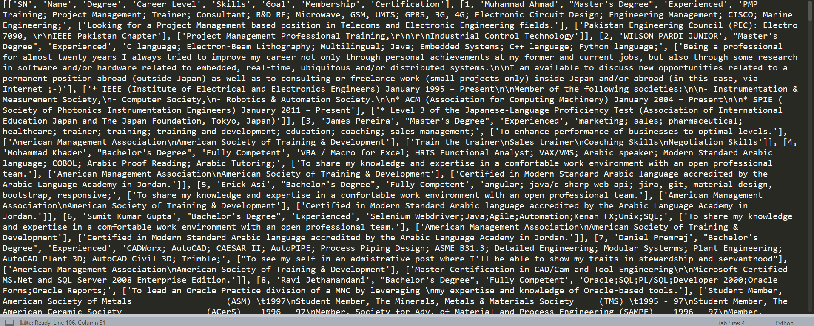

# WebScraping-Resumes
In this project using BeautifulSoup modules I have tried to scrap data of 100 employees from multiple page website and stored all of that data in CSV file with images of those 100 people.

## Introduction
This website: enlists profiles of many people and their detailed information is available on each of their respective pages. In this project I have to extract and save the following data for the first 100 employees enlisted on this thread:
1. Name
2. Degree
3. Career Level
4. Membership
5. Skills
6. Goal
7. Certification

The following information will be extracted and saved as a CSV file on my local computer.

## Problem
Now there's a small problem here. Some of these pages have ads in between two rows of profiles. In this algorithm I have to think of a way to jump over these ads to extract information only about people while skipping these ads and other irrelevant data.

## Relief
On observing manually, there is a given pattern associated with the the appearence of these ads. On figuring these patterns, the rest of the task is mechanical.

## Task
So I am not suppose to go to each of these 100 pages and get data asked by doing a right click and saving it in my computer. Since automation is happening everywhere. I will be automating the task. My task is to write a script in python to do exactly what is asked above. 

## Python libraries
The python library that will come handy in this task are BeautifulSoup, requests and CSV

## Motivation
This task seems mammoth at first look, but once done it will be wonderful to play along with this.

### Screenshot
How the dat output of 100 employees looked in my sublime editor console after executing the code.
PS: For better veiw refer temp.csv file is present in the repo.

